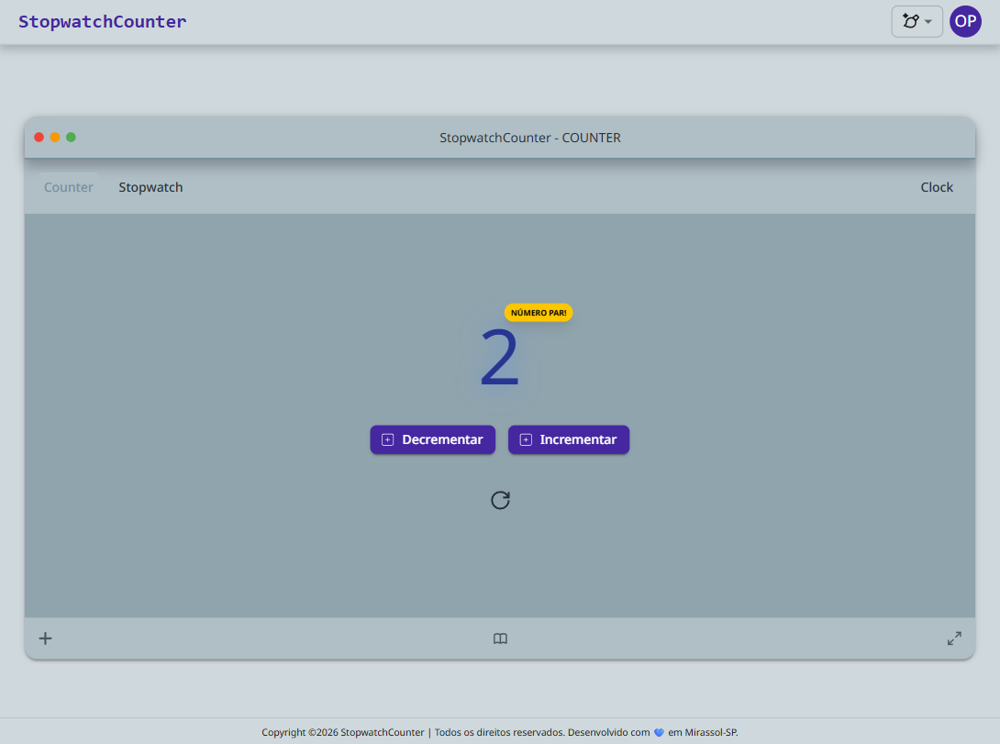
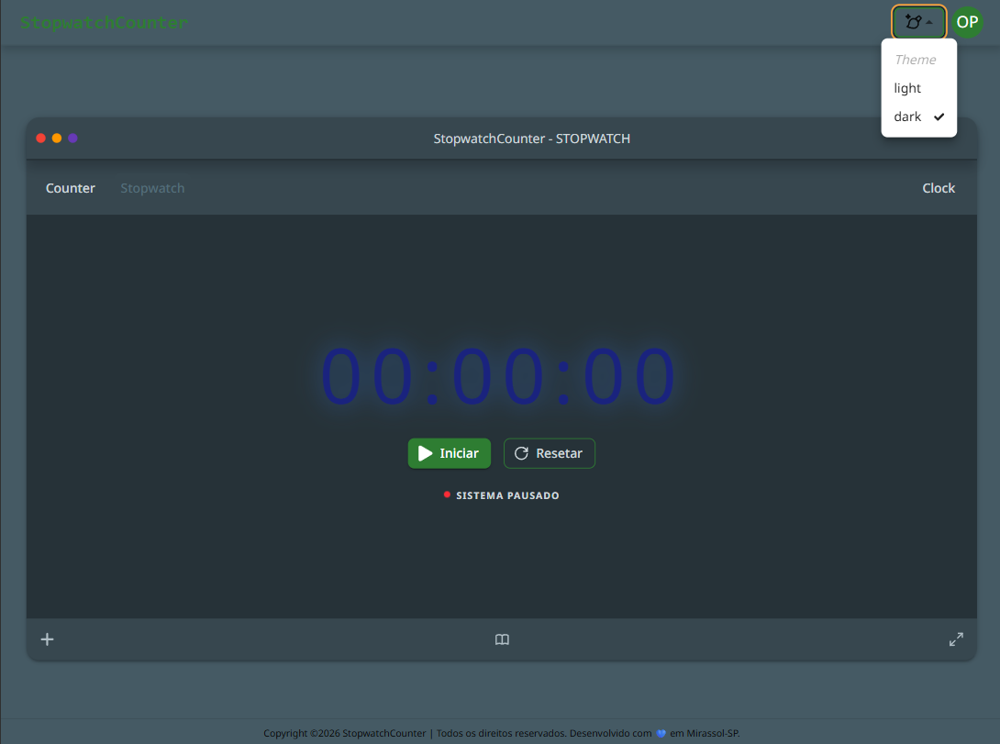

# StopwatchCounter

O **StopwatchCounter** é uma aplicação Front-end desenvolvida com foco em princípios de Engenharia de Software. O projeto integra três domínios principais — Contador, Cronômetro e Relógio — utilizando uma arquitetura baseada em Programação Orientada a Objetos (OOP) e Clean Architecture para garantir o desacoplamento total entre a lógica de negócio e a interface do usuário.

## Estrutura Arquitetural

A aplicação segue o padrão Controller-Pattern, onde os componentes React (View) delegam toda a lógica de estado e regras de negócio para classes TypeScript puras (Controllers).

- **Core:** Contém a lógica transversal, como serviços de sincronização, armazenamento e a base dos controllers.

- **Features:** Módulos isolados por domínio, contendo seus próprios componentes, controllers e estados Redux.

- **Shared:** Componentes de UI reutilizáveis construídos com a união de Material UI e TailwindCSS.

## Estrutura de Pastas
A organização segue uma abordagem modular em **Features**:

```text
src/
├── core/                   # Código que não pertence a nenhuma feature específica
│   ├── controllers/
│   ├── hooks/
│   ├── interfaces/
│   ├── services/
│   └── store/              # Redux Config
|
├── features/               # Domínios de Negócio (Isolamento de contexto)
│   ├── clock/            # Módulo do Relógio
│   │   ├── controllers/
│   │   ├── pages/
│   │   ├── services/
│   │   └── store/
|   |
│   ├── counter/            # Módulo do Contador
│   │   ├── controllers/
│   │   ├── pages/
│   │   ├── services/
│   │   └── store/
|   |
│   └── stopwatch/          # Módulo do Cronômetro
│       ├── controllers/
│       ├── pages/
│       ├── services/
│       └── store/
|
├── shared/                 # Recursos reutilizáveis entre múltiplas features
│   ├── common/             # Constantes, Utils e Navigation
│   ├── components/
│   └── enum/
|
├── routes/
└── theme/                  # Configuração de Temas (MUI Palette)
```

## Tecnologias Utilizadas

- React.js
- TypeScript
- Redux Toolkit
- Material UI
- TailwindCSS

## Design System e Arquitetura de Multitemas

A arquitetura de temas deste projeto foi desenhada para ser agnóstica, escalável e fortemente tipada. Em vez de utilizar objetos literais espalhados pelo código, centralizamos a inteligência de estilo em um motor de construção baseado em POO.

1. **Tokens de Cores** - Cada tema (Counter e Stopwatch) com seus próprios tokens em hexadecimal.

2. **Paletas de Cores** - Recebe os tokens e delega à propriedades e os torna funcionais para o Material UI.

3. **Tipagem e Module Augmentation (MUI)** - Garante o TypeScript reconheça prorpiedades fornecendo autocomplete.

4. **ThemeFactory: O Orquestrador** - Recebe os tokens e o modo (light/dark) e utiliza o método createTheme do MUI para realizar o merge entre as configurações padrão da biblioteca e as nossas customizações.

6. **Componentes Isolados e Flexibilidade do Provider**
Diferente de arquiteturas engessadas, nosso ThemeProvider foi construído para ser flexível.

- **Escopo Global:** Define o tema principal da aplicação baseado no estado do Redux.

- **Escopo Isolado:** É possível envolver um componente específico com uma instância diferente da ThemeFactory, permitindo que um componente "Stopwatch" mantenha seu tema original mesmo estando dentro da aplicação "Counter".

## Como rodar o projeto
Pré-requisitos
Node.js (Versão 18 ou superior)

npm ou yarn

Passo a passo
1. Clonar o repositório:

```tsx
git clone https://github.com/usuario/stopwatchcounter.git
cd stopwatchcounter
```

2. Instalar as dependências:

```tsx
npm install
```

3. Iniciar o servidor de desenvolvimento:

```tsx
npm run dev
```

## Screenshots




